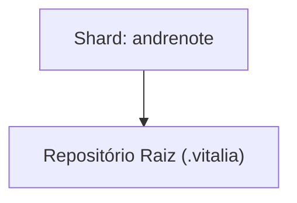

<!-- DASHBOARD.md | Atualizado em: 31-07-2026 17:19:02(GMT-04:00) -->

# Dashboard de Contexto: .vitalia

## Semáforo de Sincronização

- **Status:** LIVRE
- **Máquina:** N/A
- **Expira em:** N/A

## Shards Ativos

| Máquina | Tarefa Atual | Etapas | Status | Último Sync | Próximo Passo (P0) |
| :--- | :--- | :--- | :--- | :--- | :--- |
| **andrenote** (7f367bd3) | Observability Enhancement | Finalização da Spec 001-observability-enhancement (anti-loop, RAG, WebSockets), Auditoria SDD (/vitalia-converge) executada com 100% de conformidade, Refatoração de INSTALL.md e BENCH_TEST.md para o /docs com generalização pro Github. | Concluído | 31-07-2026 17:05:27(GMT-04:00) | Iniciar uma nova SPEC focada em automatizar o fluxo do Bench Test via script (bench_test.sh) e criar a sua interface de orquestração via botão no Dashboard. |

## Arquitetura de Contexto

