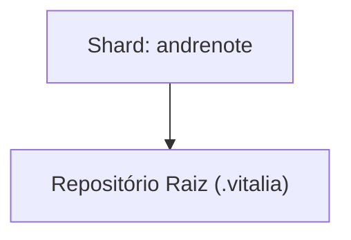

<!-- DASHBOARD.md | Atualizado em: 12-08-2026 21:33:38(GMT-04:00) -->

# Dashboard de Contexto: .vitalia

## Semáforo de Sincronização

- **Status:** LIVRE
- **Máquina:** N/A
- **Expira em:** N/A

## Shards Ativos

| Máquina | Tarefa Atual | Etapas | Status | Último Sync | Próximo Passo (P0) |
| :--- | :--- | :--- | :--- | :--- | :--- |
| **andrenote** (7f367bd3) | Observability Enhancement - Documentação e Manuais | Auditoria do código de observabilidade, atualização de ARCHITECTURE.md, EXERCICIOS-SDD.md e BENCH_TEST.md. Refatoração completa do ONBOARDING.md e INSTALL.md para Single Source of Truth. | Concluído | ⚠️ 08-08-2026 09:28:31(GMT-04:00) | Iniciar a Automação do Bench Test pipeline (criação de scripts e eventual integração visual com o Dashboard). |

## Arquitetura de Contexto

## Guard Rails de Grounding

| Arquivo | Status | Pendentes |
| :--- | :--- | :--- |
| `grounding-domains.yaml` (global) | ✅ Ativo | — |
| [grounding-domains-local.yaml](./grounding-domains-local.yaml) (projeto) | ✅ Presente — 12-08-2026 17:33 | ✅ 0 pendentes |
