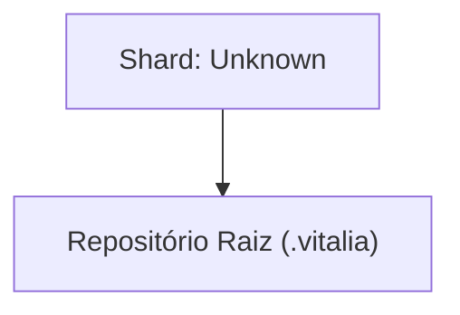

<!-- DASHBOARD.md | Atualizado em: 17-08-2026 07:08:00(GMT-04:00) -->

# Dashboard de Contexto: .vitalia

## Semáforo de Sincronização

- **Status:** LIVRE
- **Máquina:** N/A
- **Expira em:** N/A

## Shards Ativos

| Máquina | Tarefa Atual | Etapas | Status | Último Sync | Próximo Passo (P0) |
| :--- | :--- | :--- | :--- | :--- | :--- |
| **Unknown** (Unknown) | Unknown | Unknown | Unknown | Unknown | Unknown |

## Arquitetura de Contexto

## Guard Rails de Grounding

| Arquivo | Status | Pendentes |
| :--- | :--- | :--- |
| `grounding-domains.yaml` (global) | ✅ Ativo | — |
| [grounding-domains-local.yaml](./grounding-domains-local.yaml) (projeto) | ✅ Presente — 17-08-2026 03:08 | ✅ 0 pendentes |
