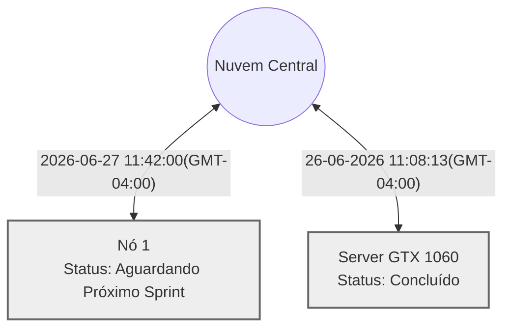

# 🧠 Painel de Contexto — Agente Local

Este repositório armazena a memória e o contexto sincronizado das sessões de trabalho guiadas por IA através do framework Vitalia.

## 📡 Topologia de Shards

## 🖥️ Máquinas e Status Atual

<table>
  <thead>
    <tr>
      <th>Máquina (ID)</th>
      <th>Tarefa Atual</th>
      <th>Status</th>
      <th>Último Sync</th>
    </tr>
  </thead>
  <tbody>
    <tr>
      <td><strong>Nó 1</strong> <code>e5897140</code></td>
      <td>Implementação da Camada 3 e Troubleshooting Local</td>
      <td>Aguardando Próximo Sprint</td>
      <td>2026-06-27 11:42:00(GMT-04:00)</td>
    </tr>
    <tr>
      <td><strong>Server GTX 1060</strong> <code>e55b4d1f</code></td>
      <td>Implementação do README e Dashboard de Contexto Automático</td>
      <td>Concluído</td>
      <td>26-06-2026 11:08:13(GMT-04:00)</td>
    </tr>
  </tbody>
</table>

## 📚 Histórico de Sessões

<strong>Clique para expandir o histórico completo</strong>

<!-- SESSION_HISTORY.md | Atualizado em: 26-06-2026 18:28:00(GMT-04:00) -->
# Histórico de Sessões (Vitalia)

## ✅ Sessão Encerrada em 26-06-2026 18:26:00(GMT-04:00)
**Máquina:** andre (e5897140)
**Tarefa:** Implementação do Global Benchmark e Data Storage
**Atividades:**
- Criação da UI de Benchmark Global c/ testes sequenciais
- Atribuição múltipla de perfis (Router, Dev, etc) c/ checks
- Correção no Event Logger p/ exibir mensagens sem truncamento
- Filtro para evitar erros com modelos de 'embedding'
- Expansão do script 'install.sh' p/ configurar data_storage
- Inicialização do repositório remoto do Data Storage
- Limpeza da raiz do projeto (Testes movidos p/ vitalia-core)
**Próxima sessão começa em:** Consolidar repositórios (via session-consolidate) e testar a robustez dos perfis de inferência mapeados no .env.

## ✅ Sessão Encerrada em 26-06-2026 11:08:13(GMT-04:00)
**Máquina:** Server GTX 1060 (e55b4d1f)
**Tarefa:** Implementação do README e Dashboard de Contexto Automático
**Atividades:**
- Criado o README.md na raiz do repositório com instruções wget
- Criado o script python (generate_context_readme.py) para o dashboard visual.
- Adicionados os hooks automáticos de geração nos workflows session-end.md e session-consolidate.md
**Próxima sessão começa em:** Iniciar a codificação da Camada 3 (Ferramenta dinâmica de Skills, Cache Redis com TTL e Gatilho Autônomo de Terminate).

## ✅ Sessão Encerrada em 25-06-2026 16:55:00(GMT-04:00)
**Máquina:** Server GTX 1060 (e55b4d1f)
**Tarefa:** Setup Camada 1 e Orquestrador (Camada 2)
**Atividades:**
- Reestruturação da Raiz (`docker-compose.yml` e `.env`).
- Construção do Event Sourcing (`logger.py` e Redis Streams).
- Implementação do Limitador de VRAM (HeadAndTailContext).
- Refatoração da Hot/Cold Strategy (`save_code_to_rag`).
- Criação do script SQL de boot do `pgvector`.
- Depuração assistida das falhas de Function Calling do LLM 3B.
- Planejamento da Camada 3 aprovado e salvo no artefato.
**Próxima sessão começa em:** Iniciar a codificação da Camada 3 (Ferramenta dinâmica de Skills, Cache Redis com TTL e Gatilho Autônomo de Terminate).

---
*Dashboard gerado automaticamente pelas automações do Vitalia Kit (session-consolidate).*