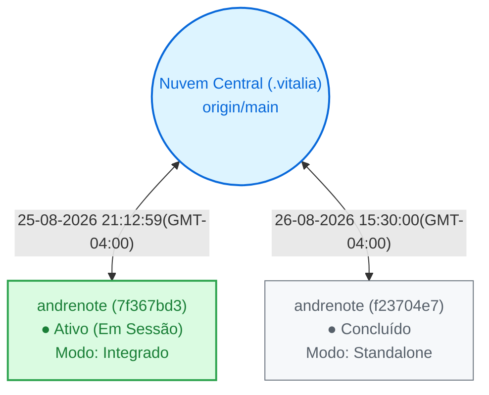

<!-- README.md | Atualizado em: 26-08-2026 16:07:52(GMT-04:00) -->

# 🧠 Painel de Contexto — .vitalia

-8250df?style=for-the-badge)

> **Vitalia Kit v0.5.0 — Ledger de Memória Persistente e Orquestração Multi-Máquina.**  
> Este repositório armazena o histórico distribuído, aprendizados consolidados e o controle de concorrência das sessões de trabalho do framework Vitalia.

---

## 📡 Topologia de Shards & Sincronização

```mermaid
flowchart TD
  Cloud(("Nuvem Central (.vitalia)<br/>origin/main"))
  M_7f367bd3["andrenote (7f367bd3)<br/>● Ativo (Em Sessão)<br/>Modo: Integrado"]
  M_f23704e7["andrenote (f23704e7)<br/>● Concluído<br/>Modo: Standalone"]

  Cloud <-->|"25-08-2026 21:12:59(GMT-04:00)"| M_7f367bd3
  Cloud <-->|"26-08-2026 15:30:00(GMT-04:00)"| M_f23704e7

  style Cloud stroke:#0969da,stroke-width:2px,fill:#ddf4ff,color:#0969da
  style M_7f367bd3 stroke:#2ea44f,stroke-width:2px,fill:#dafbe1,color:#1a7f37
  style M_f23704e7 stroke:#6e7781,stroke-width:1px,fill:#f6f8fa,color:#57606a

```

---

## 🖥️ Máquinas e Status Atual

<table>
  <thead>
    <tr>
      <th align="left">Máquina / ID</th>
      <th align="left">Tarefa Atual</th>
      <th align="center">Ambiente</th>
      <th align="center">Status</th>
      <th align="left">Último Sync</th>
      <th align="left">Próximo Passo (P0)</th>
    </tr>
  </thead>
  <tbody>
    <tr>
      <td><strong>andrenote</strong> <code>7f367bd3</code></td>
      <td>Feature 008 (Refatoração Motor de Contexto)</td>
      <td align="center">Integrado</td>
      <td align="center">● Concluído</td>
      <td>25-08-2026 21:12:59(GMT-04:00)</td>
      <td>Iniciar SDD (Spec, Plan, Tasks, Implement) para a Feature 008, reescrevendo o guardian_context.py</td>
    </tr>
    <tr>
      <td><strong>andrenote</strong> <code>f23704e7</code></td>
      <td>Feature 008 - Refatoração Engine & Guardian (Finalizada)</td>
      <td align="center">Standalone</td>
      <td align="center">● Concluído</td>
      <td>26-08-2026 15:30:00(GMT-04:00)</td>
      <td>Rodar o comando /vitalia-session-consolidate</td>
    </tr>

  </tbody>
</table>

---

## 🎯 Sessão Ativa em Destaque

- **Feature Ativa:** Feature 008 (Refatoração Motor de Contexto)
- **Máquina em Execução:** `andrenote` (`7f367bd3`)
- **Semáforo:** `LOCKED`
- **Próximo Passo (P0):**
  > Iniciar SDD (Spec, Plan, Tasks, Implement) para a Feature 008, reescrevendo o guardian_context.py

---

## 📚 Histórico, Decisões & Guard Rails

<strong>🔍 Clique para expandir Histórico e Guard Rails</strong>

### Guard Rails de Grounding

| Arquivo | Status | Pendentes |
| :--- | :--- | :--- |
| `grounding-domains.yaml` (global) | ✅ Ativo | — |
| [grounding-domains-local.yaml](./grounding-domains-local.yaml) (projeto) | ✅ Presente — 26-08-2026 12:07 | ✅ 0 pendentes |

