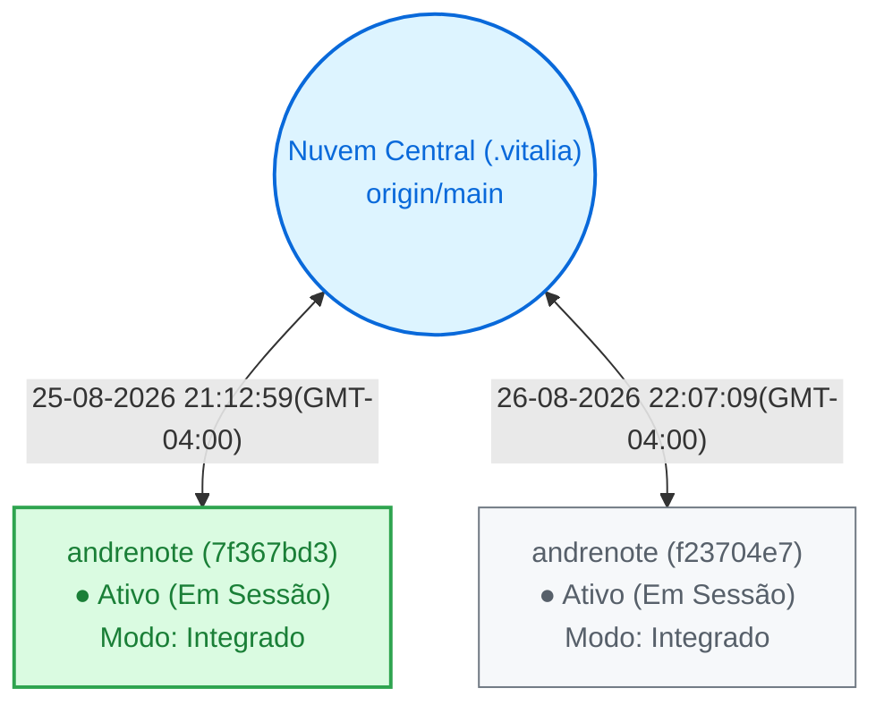

<!-- README.md | Atualizado em: 27-08-2026 12:46:51(GMT-04:00) -->

# 🧠 Painel de Contexto — .vitalia

-8250df?style=for-the-badge)

> **Vitalia Kit v0.5.0 — Ledger de Memória Persistente e Orquestração Multi-Máquina.**  
> Este repositório armazena o histórico distribuído, aprendizados consolidados e o controle de concorrência das sessões de trabalho do framework Vitalia.

---

## 📡 Topologia de Shards & Sincronização

```mermaid
flowchart TD
  Cloud(("Nuvem Central (.vitalia)<br/>origin/main"))
  M_7f367bd3["andrenote (7f367bd3)<br/>● Ativo (Em Sessão)<br/>Modo: Integrado"]
  M_f23704e7["andrenote (f23704e7)<br/>● Ativo (Em Sessão)<br/>Modo: Integrado"]

  Cloud <-->|"25-08-2026 21:12:59(GMT-04:00)"| M_7f367bd3
  Cloud <-->|"26-08-2026 22:07:09(GMT-04:00)"| M_f23704e7

  style Cloud stroke:#0969da,stroke-width:2px,fill:#ddf4ff,color:#0969da
  style M_7f367bd3 stroke:#2ea44f,stroke-width:2px,fill:#dafbe1,color:#1a7f37
  style M_f23704e7 stroke:#6e7781,stroke-width:1px,fill:#f6f8fa,color:#57606a

```

---

## 🖥️ Máquinas e Status Atual

<table>
  <thead>
    <tr>
      <th align="left">Máquina / ID</th>
      <th align="left">Tarefa Atual</th>
      <th align="center">Ambiente</th>
      <th align="center">Status</th>
      <th align="left">Último Sync</th>
      <th align="left">Próximo Passo (P0)</th>
    </tr>
  </thead>
  <tbody>
    <tr>
      <td><strong>andrenote</strong> <code>7f367bd3</code></td>
      <td>Feature 008 (Refatoração Motor de Contexto)</td>
      <td align="center">Integrado</td>
      <td align="center">● Concluído</td>
      <td>25-08-2026 21:12:59(GMT-04:00)</td>
      <td>Iniciar SDD (Spec, Plan, Tasks, Implement) para a Feature 008, reescrevendo o guardian_context.py</td>
    </tr>
    <tr>
      <td><strong>andrenote</strong> <code>f23704e7</code></td>
      <td>Feature 008-context-engine</td>
      <td align="center">Integrado</td>
      <td align="center">● Concluído</td>
      <td>26-08-2026 22:07:09(GMT-04:00)</td>
      <td>Validação das views consolidadas (Dashboard, DECISIONS.md, LEARNINGS.md) no repositório remoto ou iniciar Feature 009.</td>
    </tr>

  </tbody>
</table>

---

## 🎯 Sessão Ativa em Destaque

- **Feature Ativa:** Feature 008-context-engine
- **Máquina em Execução:** `andrenote` (`7f367bd3`)
- **Semáforo:** `LIVRE`
- **Próximo Passo (P0):**
  > Validação das views consolidadas (Dashboard, DECISIONS.md, LEARNINGS.md) no repositório remoto ou iniciar Feature 009.

---

## 📚 Histórico, Decisões & Guard Rails

<strong>🔍 Clique para expandir o Histórico Completo de Sessões</strong>

 

### ✅ Sessão Encerrada em 26-08-2026 22:07(GMT-04:00)
- **Máquina:** `Unknown` (`f23704e7`)
- **Tarefa:** Feature 008-context-engine
- **Atividades:**
  - Sem resumo.
- **Próximo Passo:** Validação das views consolidadas (Dashboard, DECISIONS.md, LEARNINGS.md) no repositório remoto ou iniciar Feature 009.

---

### ✅ Sessão Encerrada em Desconhecida
- **Máquina:** `Unknown` (`f23704e7`)
- **Tarefa:** Feature 008 - Refatoração Engine & Guardian (Finalizada)
- **Atividades:**
  - Sem resumo.
- **Próximo Passo:** Rodar o comando /vitalia-session-consolidate

---

### ✅ Sessão Encerrada em Desconhecida
- **Máquina:** `andrenote` (`7f367bd3`)
- **Tarefa:** session_history
- **Atividades:**
  - Sem resumo.
- **Próximo Passo:** Unknown

---

### ✅ Sessão Encerrada em Desconhecida
- **Máquina:** `andrenote` (`7f367bd3`)
- **Tarefa:** Brainstorming e PRD Técnico da Feature 008 (Controle de Contexto & UX/UI)
- **Atividades:**
  - Sem resumo.
- **Próximo Passo:** Iniciar o ciclo SDD da Feature 008 acionando /vitalia-spec-specify para gerar spec.md e plan.md com base no PRD

---

### ✅ Sessão Encerrada em Desconhecida
- **Máquina:** `andrenote` (`7f367bd3`)
- **Tarefa:** Benchmark de Indústria, Saneamento de Testes e Sincronização do Kit Global
- **Atividades:**
  - Sem resumo.
- **Próximo Passo:** Iniciar ciclo SDD da Feature 008 (Refatoração do Motor de Contexto vitalia_context_engine.py, state/semaphore.json e README.md visual)

---

### ✅ Sessão Encerrada em Desconhecida
- **Máquina:** `andrenote` (`7f367bd3`)
- **Tarefa:** Feature 007 (Emenda 1) - Environment Bootstrap, Probes Ativos e Menu HITL
- **Atividades:**
  - Sem resumo.
- **Próximo Passo:** Iniciar Feature 008 (Refatoracao do Motor de Contexto vitalia_context_engine.py, state/semaphore.json e README.md visual)

---

### ✅ Sessão Encerrada em Desconhecida
- **Máquina:** `andrenote` (`7f367bd3`)
- **Tarefa:** Feature 007 - Testes de Integração e E2E do Guardian de Contexto
- **Atividades:**
  - Sem resumo.
- **Próximo Passo:** Refatoração do mecanismo de exibição de contexto no repositório da nuvem (vitalia_context_engine.py e README.md visual — Feature 008)

---

### ✅ Sessão Encerrada em Desconhecida
- **Máquina:** `Unknown` (`7f367bd3`)
- **Tarefa:** Feature 007 - Guardian de Contexto
- **Atividades:**
  - Sem resumo.
- **Próximo Passo:** Testes end-to-end do Guardian na próxima feature simulada.

---

### ✅ Sessão Encerrada em Desconhecida
- **Máquina:** `andrenote` (`7f367bd3`)
- **Tarefa:** Unknown Task
- **Atividades:**
  - Sem resumo.
- **Próximo Passo:** Iniciar SDD Feature 007 via /vitalia-spec-specify

---

### ✅ Sessão Encerrada em Desconhecida
- **Máquina:** `andre-desktop` (`f23704e7`)
- **Tarefa:** Unknown Task
- **Atividades:**
  - Sem resumo.
- **Próximo Passo:** Incorporar agentes vitalia-agent-kit-main no kit atual (Feature 008)

---

### ✅ Sessão Encerrada em Desconhecida
- **Máquina:** `andrenote` (`7f367bd3`)
- **Tarefa:** Feature 006: grounding-guard-rails + correção de regressões em workflows
- **Atividades:**
  - Sem resumo.
- **Próximo Passo:** Publicar repositórios no GitHub usando publicar-repos.md

---

### ✅ Sessão Encerrada em Desconhecida
- **Máquina:** `andrenote` (`7f367bd3`)
- **Tarefa:** Feature 006: grounding-guard-rails + correção de regressões
- **Atividades:**
  - Sem resumo.
- **Próximo Passo:** Publicar repositórios no GitHub usando publicar-repos.md

---

### ✅ Sessão Encerrada em Desconhecida
- **Máquina:** `andrenote` (`7f367bd3`)
- **Tarefa:** Feature 006: grounding-guard-rails + correção de regressões
- **Atividades:**
  - Sem resumo.
- **Próximo Passo:** Publicar repositórios no GitHub usando publicar-repos.md

---

### ✅ Sessão Encerrada em Desconhecida
- **Máquina:** `Unknown` (`7f367bd3`)
- **Tarefa:** Feature 006: grounding-guard-rails + correção de regressões em workflows
- **Atividades:**
  - Sem resumo.
- **Próximo Passo:** Iniciar o planejamento e documentação da próxima feature (Feature 007) ou iniciar um novo fluxo de trabalho.

---

### ✅ Sessão Encerrada em Desconhecida
- **Máquina:** `andrenote` (`7f367bd3`)
- **Tarefa:** Feature 006: grounding-guard-rails + correção de regressões
- **Atividades:**
  - Sem resumo.
- **Próximo Passo:** Publicar repositórios no GitHub usando publicar-repos.md

---

### ✅ Sessão Encerrada em Desconhecida
- **Máquina:** `Unknown` (`7f367bd3`)
- **Tarefa:** Observability Enhancement - Documentação e Manuais
- **Atividades:**
  - Sem resumo.
- **Próximo Passo:** Iniciar a Automação do Bench Test pipeline (criação de scripts e eventual integração visual com o Dashboard).

---

<strong>⚖️ Clique para expandir as Decisões Arquiteturais Consolidadas</strong>

 

| Máquina (ID) | Decisão Arquitetural | Impacto / Racional |
| :--- | :--- | :--- |
| **Máquina** (`7f367bd3`) | **KIT** | [DECISÃO] Priorização estrita da Feature 008 no saneamento de débitos técnicos (motor de contexto e semáforo isolado em state/semaphore.json), postergando incorporação de novos agentes para ciclos futuros. |
| **Máquina** (`7f367bd3`) | **KIT** | [DECISÃO] Adoção do padrão Layered Evaluation Architecture (Chão Determinístico em código para permissão de ferramentas por fase + Teto Semântico no LLM Judge local Qwen para aderência à Constituição/regras clínicas). |
| **Máquina** (`7f367bd3`) | **DEC-007: Probes Reais de Conectividade com Credenciais do Workspace** | Hooks usam REDIS_URL e NO2_SERVER_IP reais para verificar saude dos servicos em tempo real. |
| **Máquina** (`7f367bd3`) | **DEC-006: Protocolo HITL para Falhas de Ambiente** | Adotado menu interativo com 3 opcoes (Autocorrecao, Fallback de degradacao, Parada imediata) em caso de .env/.venv ausentes ou containers desligados. |
| **Máquina** (`7f367bd3`) | **DEC-005: Bootstrap Central de Ambiente (kit_env_bootstrap.py)** | Criado helper kit_env_bootstrap.py com auto-descoberta de raiz, parser .env nativo e injecao de site-packages do .venv no sys.path para todos os hooks do kit. |
| **Máquina** (`7f367bd3`) | **Decisão** | [KIT] Padrão Vitalia para scripts invocados por hooks .toml: Opção C — stdlib-only obrigatório. Módulos externos (redis, requests, ollama) são importados dinamicamente com try/except, nunca como dependência rígida. Garante funcionamento em qualquer Python 3 sem venv. |
| **Máquina** (`7f367bd3`) | **Decisão** | [KIT] scan_environment.py deve: (1) probar conectividade real de Redis (import dinâmico + ping com timeout), (2) probar Ollama/NO2 via HTTP, (3) usar sufixo PID no output (env_context_<pid>.json) para evitar colisão entre workflows paralelos, (4) detectar e reportar VIRTUAL_ENV ativo. |
| **Máquina** (`7f367bd3`) | **Decisão** | [ARCH] Curadoria do grounding-domains.jsonl (promoção de entradas local→global, rejeição) deve ser responsabilidade exclusiva do workflow session-end, com etapa HITL que consulte o usuário. Curadoria manual direta nos arquivos é inaceitável. |
| **Máquina** (`62a9aef0`) | **Decisão** | [SEGURANÇA SPA] O Dashboard Local não deve acessar PHI no Redis sem redação (Masking) em tempo real via WebSocket, e exige JWT estrito para o front. |
| **Máquina** (`62a9aef0`) | **Decisão** | [DECISÃO] Adotado Opção A (Narrow Tooling) para Arquiteto e Opção A (On-the-loop sync) para Task Verifier. |
| **Máquina** (`62a9aef0`) | **Decisão** | [TECH DEBT] Implantar Opção A (State Machine/LangGraph determinística) para Enforcement do SDD. Atualmente usando Opção B (Prompt Reinforcement) provisoriamente. |
| **Máquina** (`62a9aef0`) | **Decisão** | [TECH DEBT] O workflow brainstorming ignorava o contexto. Solução: delegar a recuperação de contexto ao Sub-Agente para evitar estouro de tokens (window overflow) e alucinações, em vez de injetar o histórico inteiro. Risco provisório aceito: PHI nos logs crus até que o Sub-Agente Guardião seja construído para sanitização (Data Vault). |
| **Máquina** (`f23704e7`) | **Decisão** | Artigo I da Constituição emendado: SDD passa a ser ciclo PEV de 6 etapas formais (RAG Sync → specify → plan → tasks → Task Verifier Gate → implement). |
| **Máquina** (`f23704e7`) | **Decisão** | Separação kit × projeto: todos os 4 arquivos desta sessão foram criados/modificados exclusivamente em ~/.vitalia/kit/. O projeto agente-local não foi tocado. |
| **Máquina** (`7f367bd3`) | **Decisão** | Thin Client e Agnosticismo de Paths: Arquivos nos diretórios locais .agents / .gemini são meros shims; lógicas e templates devem ser consumidos do Kit Global e referenciados por {{VITALIA_DIR}} para evitar hardcoding. |
| **Máquina** (`7f367bd3`) | **Decisão** | Observabilidade via Dashboard de Vidro: Todas as execuções de LLM locais interceptadas via Fernet encryption para a fila vitalia_events, permitindo visualização de logs em WebSockets para depurar debates entre Arquiteto e Engenheiro. |
| **Máquina** (`7f367bd3`) | **Decisão** | Sub-Agente Policy & Task Verifier (Híbrido): Nova etapa silenciosa entre o spec-tasks e spec-implement. Usa script Python para quebrar tarefas e Qwen2.5-coder:7b para micro-inferência 1-para-1, barrando transições se houver violações. |
| **Máquina** (`7f367bd3`) | **Decisão** | Abandono de Múltiplos Arquivos de Spec: Em vez de spec médica, pedagógica etc. separadas, usa-se o workflow /vitalia-spec-specify acoplado ao sistema de Presets, modulando as seções da spec dinamicamente no runtime. |

<strong>🛡️ Clique para expandir os Guard Rails de Grounding e Domínios</strong>

 

| Arquivo de Regras | Status | Domínios Monitorados | Pendentes de Curadoria HITL |
| :--- | :---: | :--- | :---: |
| `grounding-domains.yaml` (Global) | ✅ Ativo | `llm_models`, `python_packages`, `external_apis`, `security_practices`, `regulations`, `cloud_services`, `scientific_claims` | — |
| [grounding-domains-local.yaml](./grounding-domains-local.yaml) (Projeto) | ✅ Presente | Domínios locais específicos do workspace | ✅ 0 pendentes |

---

Painel gerado automaticamente pelo motor de contexto do Vitalia Kit (<code>vitalia_context_engine.py --action consolidate</code>).
