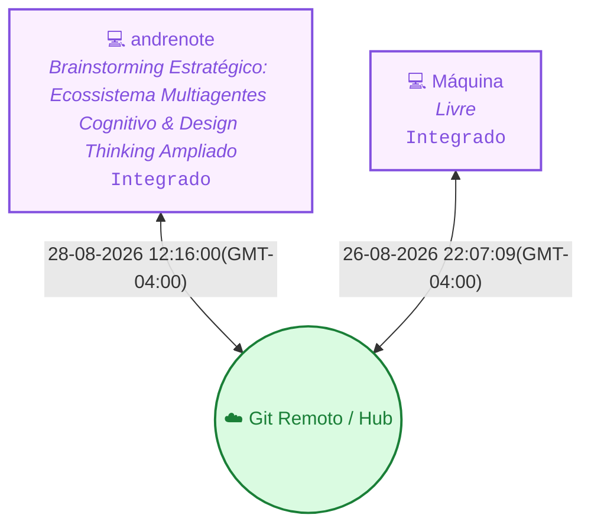

<!-- README.md | Atualizado em: 28-08-2026 12:18:06(GMT-04:00) -->

# 🧠 Painel de Contexto — agente-local

> **Vitalia Kit v0.5.0 — Ledger de Memória Persistente e Orquestração Multi-Máquina.**  
> Este repositório armazena o histórico distribuído, aprendizados consolidados e o controle de concorrência das sessões de trabalho do framework Vitalia.

---

## 📡 Topologia de Shards & Sincronização

```mermaid
flowchart TD
  Cloud(("☁️ Git Remoto / Hub"))
  M_7f367bd3["💻 andrenote<br/><i>Brainstorming Estratégico: Ecossistema Multiagentes Cognitivo & Design Thinking Ampliado</i><br/><code>Integrado</code>"]
  M_7f367bd3 <-->|"28-08-2026 12:16:00(GMT-04:00)"| Cloud
  style M_7f367bd3 stroke:#8250df,stroke-width:2px,fill:#fbefff,color:#8250df
  M_f23704e7["💻 Máquina<br/><i>Livre</i><br/><code>Integrado</code>"]
  M_f23704e7 <-->|"26-08-2026 22:07:09(GMT-04:00)"| Cloud
  style M_f23704e7 stroke:#8250df,stroke-width:2px,fill:#fbefff,color:#8250df
  style Cloud stroke:#1a7f37,stroke-width:2px,fill:#dafbe1,color:#1a7f37
```

---

## 🖥️ Máquinas e Status Atual

<table>
  <thead>
    <tr>
      <th align="left">Máquina / ID</th>
      <th align="left">Tarefa Atual</th>
      <th align="center">Ambiente</th>
      <th align="center">Status</th>
      <th align="left">Último Sync</th>
      <th align="left">Próximo Passo (P0)</th>
    </tr>
  </thead>
  <tbody>
    <tr>
      <td><strong>andrenote</strong> (<code>7f367bd3</code>)</td>
      <td>Brainstorming Estratégico: Ecossistema Multiagentes Cognitivo & Design Thinking Ampliado</td>
      <td align="center"></td>
      <td align="center">● Concluído</td>
      <td>28-08-2026 12:16:00(GMT-04:00)</td>
      <td><strong>Adequar o código que não foi tocado no último turno às modificações da spec 009</strong></td>
    </tr>
    <tr>
      <td><strong>unknown</strong> (<code>f23704e7</code>)</td>
      <td></td>
      <td align="center"></td>
      <td align="center">● Concluído</td>
      <td>26-08-2026 22:07:09(GMT-04:00)</td>
      <td><strong></strong></td>
    </tr>
  </tbody>
</table>

---

## 🎯 Sessão Ativa em Destaque

- **Estação Ativa:** `andrenote` (`7f367bd3`)
- **Tarefa em Execução:** Brainstorming Estratégico: Ecossistema Multiagentes Cognitivo & Design Thinking Ampliado
- **🎯 Próximo Passo Prioritário (P0):** `Adequar o código que não foi tocado no último turno às modificações da spec 009`
- **Última Sincronização:** `28-08-2026 12:16:00(GMT-04:00)`

---

## 📚 Histórico, Decisões & Guard Rails

<strong>🔍 Clique para expandir o Histórico Completo de Sessões</strong>

 

| Data / Hora | Estação (ID) | Tarefa Executada | Próximo Passo (P0) |
| :--- | :--- | :--- | :--- |
| 28-08-2026 12:16:00(GMT-04:00) | `machine (7f367bd3)` | Brainstorming Estratégico: Ecossistema Multiagentes Cognitivo & Design Thinking Ampliado | `Adequar o código que não foi tocado no último turno às modificações da spec 009` |
| 28-08-2026 09:12:43(GMT-04:00) | `andrenote (7f367bd3)` | Feature 009: Refatoração Estrutural e Governança SDD do Vitalia Kit | `Iniciar próxima feature do roadmap Vitalia (Feature 010) ou sincronizar via /vitalia-session-consolidate` |
| 26-08-2026 22:07(GMT-04:00) | `machine (f23704e7)` | Feature 008-context-engine | `Validação das views consolidadas (Dashboard, DECISIONS.md, LEARNINGS.md) no repositório remoto ou iniciar Feature 009.` |
|  | `Unknown (f23704e7)` | Feature 008 - Refatoração Engine & Guardian (Finalizada) | `Rodar o comando /vitalia-session-consolidate` |
|  | `andrenote (7f367bd3)` | session_history | `Unknown` |
|  | `andrenote (7f367bd3)` | Brainstorming e PRD Técnico da Feature 008 (Controle de Contexto & UX/UI) | `Iniciar o ciclo SDD da Feature 008 acionando /vitalia-spec-specify para gerar spec.md e plan.md com base no PRD` |
|  | `andrenote (7f367bd3)` | Benchmark de Indústria, Saneamento de Testes e Sincronização do Kit Global | `Iniciar ciclo SDD da Feature 008 (Refatoração do Motor de Contexto vitalia_context_engine.py, state/semaphore.json e README.md visual)` |
|  | `andrenote (7f367bd3)` | Feature 007 (Emenda 1) - Environment Bootstrap, Probes Ativos e Menu HITL | `Iniciar Feature 008 (Refatoracao do Motor de Contexto vitalia_context_engine.py, state/semaphore.json e README.md visual)` |
|  | `andrenote (7f367bd3)` | Feature 007 - Testes de Integração e E2E do Guardian de Contexto | `Refatoração do mecanismo de exibição de contexto no repositório da nuvem (vitalia_context_engine.py e README.md visual — Feature 008)` |
|  | `Unknown (7f367bd3)` | Feature 007 - Guardian de Contexto | `Testes end-to-end do Guardian na próxima feature simulada.` |

<strong>⚖️ Clique para expandir as Decisões Arquiteturais Consolidadas</strong>

 

| Máquina (ID) | Decisão Arquitetural | Impacto / Racional |
| :--- | :--- | :--- |
| `7f367bd3` | **[f3a588e4aab8685c]** `ARQUITETURA` Expansão do /vitalia-brainstorming como Hub Socrático orquestrador de 5 especialistas autônomos invocáveis diretamente via Slash Commands (/vitalia-design-thinking, /vitalia-literature-curator, /vitalia-visual-creator, /vitalia-medical-gate, /vitalia-architect), com isolamento de acervo em data_storage/. | Registro defasado |
| `7f367bd3` | **[a3265e04]** `[KIT]` Avaliador Local Multi-Fase hooks/llm_judge.py com hierarquia estrita de severidades | Bloqueia (exit 1) apenas violações clínicas, de LGPD e de integridade SDD, tratando regras de didática e formatação como avisos (exit 2) com confirmação HITL. |
| `7f367bd3` | **[94069e8d]** `[SECURITY]` Schema-Safe Context Pruning para constitution_data.yaml com teto calibrado de 500 tokens | Evita context bloat e diluição de atenção do LLM sem comprometer as salvaguardas constitucionais obrigatórias. |
| `7f367bd3` | **[7f00ea3d]** `[ARCH]` Modular Monolith Flat Layout dividindo o Context Engine em core/, rendering/, hooks/ e maintenance/ | Desacopla responsabilidades, melhora a manutenibilidade e reduz o entrypoint raiz para <40 linhas mantendo 100% de compatibilidade stdlib. |
| `7f367bd3` | **[d009kit]** `KIT`  | Registro defasado |
| `7f367bd3` | **[d008kit]** `KIT`  | Registro defasado |
| `7f367bd3` | **[dec_007_live_probes]** `[ARCH]` Hooks usam REDIS_URL e NO2_SERVER_IP reais para verificar saude dos servicos em tempo real. | Registro defasado |
| `7f367bd3` | **[dec_006_hitl_env]** `[ARCH]` Adotado menu interativo com 3 opcoes (Autocorrecao, Fallback de degradacao, Parada imediata) em caso de .env/.venv ausentes ou containers desligados. | Registro defasado |
| `7f367bd3` | **[dec_005_bootstrap]** `[ARCH]` Criado helper kit_env_bootstrap.py com auto-descoberta de raiz, parser .env nativo e injecao de site-packages do .venv no sys.path para todos os hooks do kit. | Registro defasado |
| `7f367bd3` | **[71b866cb2e9c989a]** `[ARCH]` [KIT] Padrão Vitalia para scripts invocados por hooks .toml: Opção C — stdlib-only obrigatório. Módulos externos (redis, requests, ollama) são importados dinamicamente com try/except, nunca como dependência rígida. Garante funcionamento em qualquer Python 3 sem venv. | Registro defasado |

<strong>🛡️ Clique para expandir os Guard Rails de Grounding e Domínios</strong>

 

| Arquivo de Regras | Status | Domínios Monitorados | Pendentes de Curadoria HITL |
| :--- | :---: | :--- | :---: |
| `grounding-domains.yaml` (Global) | ✅ Ativo | `llm_models`, `python_packages`, `external_apis`, `security_practices`, `regulations`, `cloud_services`, `scientific_claims` | — |
| `grounding-domains-local.yaml` (Projeto) | ✅ Sincronizado | Domínios locais específicos do workspace | `0 pendências` |

---

Painel gerado automaticamente pelo motor de contexto do Vitalia Kit (<code>vitalia_context_engine.py --action consolidate</code>).
